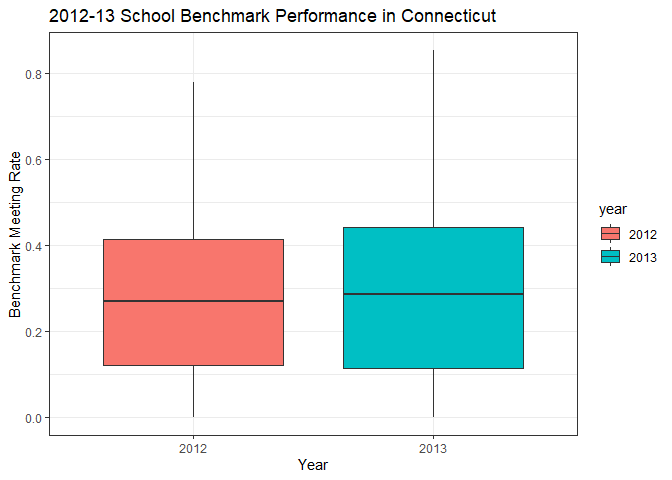
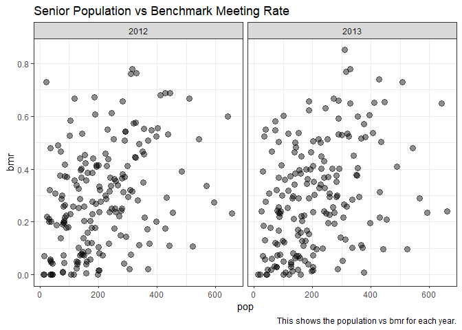
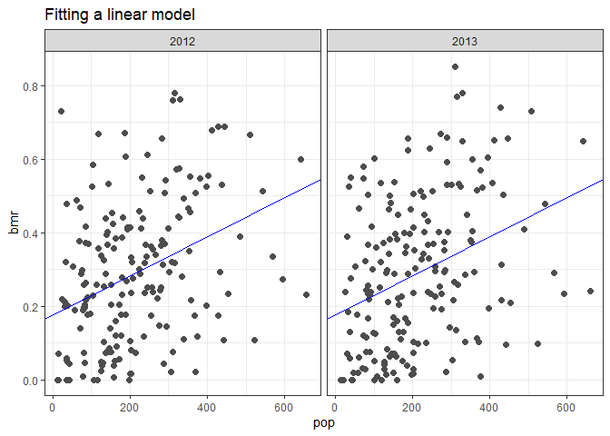
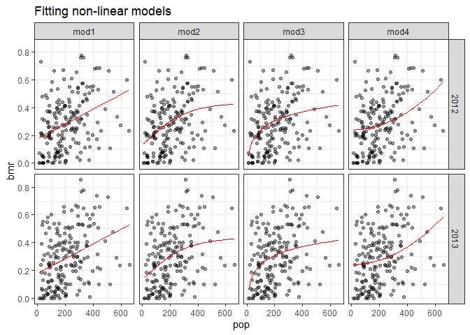
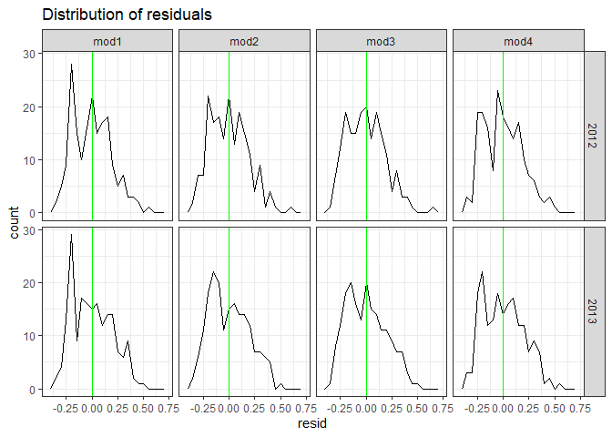
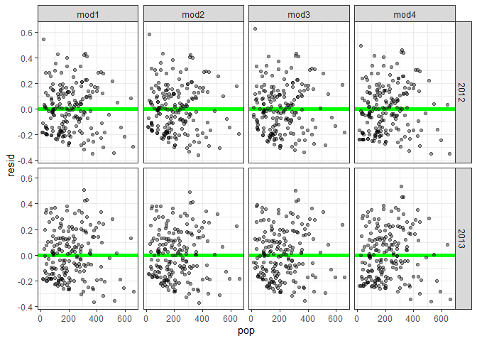
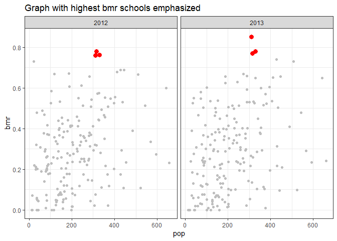
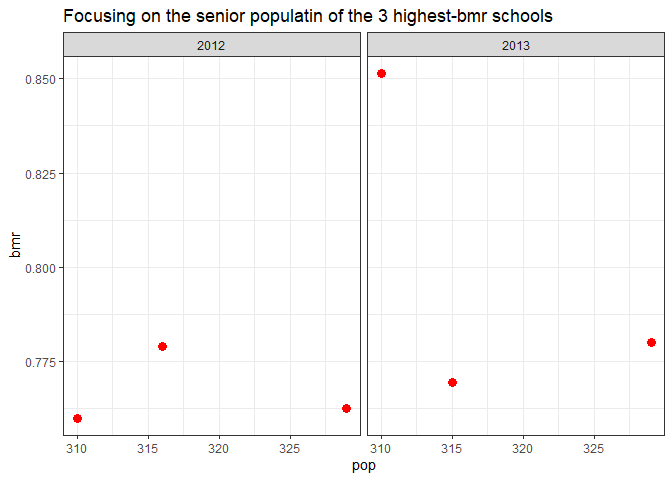

SAT Benchmark Performance in Connecticut in 2012-13
================

By Micheal Chen , Mingyang Su and Alex P Zhang

## Introduction

Our goal is to practice and develop our Exploratory Data Analysis(EDA)
skills in R.

In this project we analyze the distributions of SAT Benchmark
Performance among high schools in the state of Connecticut from 2012 to
2013, then try to find the relationship between the number of senior
students and their SAT Benchmark Performance.

This project uses a primary dataset
which(SAT\_School\_Participation\_and\_Performance\_\_2012-2013.csv) has
been downloaded from the link:
<https://catalog.data.gov/dataset/sat-school-participation-and-performance-2012-2013>.

The SAT benchmarks are designed to measure the college readiness of high
school students, using the SAT, a college entrance examination taken by
nearly 1.45 million students in all 50 United States and the District of
Columbia. The SAT benchmark determined in this study was 1550 for the
composite. According to research conducted by the College Board, a score
of 1550 indicates that a student will have a 65 percent or greater
likelihood of achieving a B- average or higher during the first year of
college. (College Board. 250 Vesey Street, New York, NY 10281. Tel:
212-713-8000; e-mail: <research@collegeboard.org>; Web site:
<http://research.collegeboard.org>)

The primary dataset provided SAT Benchmark Meeting and participation
rate, but it did not exactly show how many senior students reach the
Benchmark, and the Percent among the total number of senior students in
the schools. Therefore, we created a new index called BMR(Benchmark
Meeting Rate),which comes through the number of Benchmark-Meeting
seniors divided by the number of total seniors in the same school. We
use BMR to evaluate SAT Benchmark Performance among high schools in
Connecticut in 2012 and
2013.

## Questions and Findings

### What is the relationship between a school’s senior population and the school’s benchmark-meeting rate?

``` r
data <- read_csv("C:/Users/alex/Documents/SAT-Benchmark-Group-Report/SAT_School_Participation_and_Performance__2012-2013.csv")
```

    ## Parsed with column specification:
    ## cols(
    ##   `District Number` = col_double(),
    ##   District = col_character(),
    ##   School = col_character(),
    ##   `Test-takers: 2012` = col_double(),
    ##   `Test-takers: 2013` = col_double(),
    ##   `Test-takers: Change%` = col_double(),
    ##   `Participation Rate (estimate): 2012` = col_double(),
    ##   `Participation Rate (estimate): 2013` = col_double(),
    ##   `Participation Rate (estimate): Change%` = col_double(),
    ##   `Percent Meeting Benchmark: 2012` = col_double(),
    ##   `Percent Meeting Benchmark: 2013` = col_double(),
    ##   `Percent Meeting Benchmark: Change%` = col_double()
    ## )

``` r
df <- data %>% 
  select(-1, -6, -9, -12) %>% 
  rename(district = "District", school = "School", t_takes2012 = "Test-takers: 2012", t_takes2013 = "Test-takers: 2013", part_rate2012 = "Participation Rate (estimate): 2012", part_rate2013 = "Participation Rate (estimate): 2013", perc_mb2012 = "Percent Meeting Benchmark: 2012", perc_mb2013 = "Percent Meeting Benchmark: 2013")
df <- df %>% 
  dplyr::filter(!(is.na(t_takes2012) | is.na(t_takes2013) | is.na(part_rate2012) | is.na(part_rate2013) | is.na(perc_mb2012) | is.na(perc_mb2013)))
```

``` r
#df1 is for testtakers for each school+year
df1 <- df %>% 
  select(1:4) %>% 
  rename(`2012` = t_takes2012, `2013` = t_takes2013) %>% 
  gather(3,4,key = "year", value = "t_takes") %>% 
  arrange(school)
#df2 is participation rate for each school+year
df2 <- df %>% select(1,2,5,6) %>% 
  rename(`2012` = part_rate2012, `2013` = part_rate2013) %>% 
  gather(3,4,key = "year", value = "part_rate")
#df3 is percentage meeting benchmark for each school+year
df3 <- df %>% 
  select(1,2,7,8) %>% 
  rename(`2012` = perc_mb2012, `2013` = perc_mb2013) %>% 
  gather(3,4,key = "year", value = "perc_mb")
#df4 combines them all
#BMR is calculated as such:
#bmr = number of meeting Benchmark / number of total seniors = (t_takes*perc_mb) / (t_takes/part_rate) = perc_mb*part_rate
df4 <- df1 %>% 
  full_join(df2,by = c("district","school","year")) %>% 
  full_join(df3,by = c("district","school","year"))
df4 <- df4 %>% 
  mutate(bmr = perc_mb*part_rate*1e-4)
```

First we’ll get the senior population for each school (denoted as pop)

``` r
data <- df4 %>% mutate(pop = floor(1e2*t_takes / part_rate))
data
```

    ## # A tibble: 374 x 8
    ##    district        school      year  t_takes part_rate perc_mb    bmr   pop
    ##    <chr>           <chr>       <chr>   <dbl>     <dbl>   <dbl>  <dbl> <dbl>
    ##  1 Stamford        Academy of~ 2012      133        82      47 0.385    162
    ##  2 Stamford        Academy of~ 2013      142        88      51 0.449    161
    ##  3 Connecticut Te~ Albert I P~ 2012       92        58       1 0.0058   158
    ##  4 Connecticut Te~ Albert I P~ 2013       88        55       0 0        160
    ##  5 Amistad Academ~ Amistad Ac~ 2012       34       100      32 0.32      34
    ##  6 Amistad Academ~ Amistad Ac~ 2013       31       100      39 0.39      31
    ##  7 Regional 05     Amity Regi~ 2012      381        87      61 0.531    437
    ##  8 Regional 05     Amity Regi~ 2013      348        80      63 0.504    435
    ##  9 Ansonia         Ansonia Hi~ 2012      118        67      18 0.121    176
    ## 10 Ansonia         Ansonia Hi~ 2013      104        61      18 0.110    170
    ## # ... with 364 more rows

Let’s see the trend of bmr vs year

``` r
data %>% 
  ggplot(aes(x = year, y = bmr, fill = year)) + 
  geom_boxplot() + labs(
    title = "2012-13 School Benchmark Performance in Connecticut",
    y = "Benchmark Meeting Rate", x = "Year"
  ) + theme_bw()
```

<!-- -->

From the graphic above , in 2012 the BMRs of Connecticut schools
distributed from 0 to 80 percent, but in 2013 the rate went up a little
bit, a couple of schools’ numbers almost over 80 percent.

We’ll plot the data to see if we can recognize any patterns.

``` r
ggplot(data) + 
  geom_point(aes(pop,bmr),alpha=4/9,size=3) + 
  facet_wrap(~year) + 
  theme_bw() + 
  labs(title="Senior Population vs Benchmark Meeting Rate",caption="This shows the population vs bmr for each year.")
```

<!-- -->

The data is relatively scattered, but we can see a weak positive linear
trend.

We can create a linear model using root mean squared residuals.

``` r
#root-mean-square residuals
measure_distance <- function(mod,data){
  diff <- data$bmr - (mod[1] + data$pop*mod[2])
  sqrt(mean(diff^2))
}
best <- optim(c(0, 0), measure_distance, data = data)
ggplot(data, aes(pop, bmr)) + 
  geom_point(size = 2, colour = "grey30") + 
  geom_abline(color="blue",intercept = best$par[1], slope = best$par[2]) + 
  theme_bw() + 
  labs(title="Fitting a linear model") + 
  facet_wrap(~year)
```

<!-- -->

However, there’s still many points in the data that are far from our
linear model. Let’s try out some nonlinear models to see if it can fit
the data any better.

``` r
mod1 <- lm(bmr ~ ns(pop, 1), data = data)
mod2 <- lm(bmr ~ ns(pop, 2), data = data)
mod3 <- lm(bmr ~ log(pop, base = exp(1)), data = data)
mod4 <- lm(bmr ~ I(pop^2), data = data)
data %>% 
  gather_predictions(mod1, mod2, mod3, mod4) %>%
  ggplot(aes(pop, bmr)) + 
  geom_point(alpha=2/5) +
  geom_line(aes(pop,pred), colour = "red") +
  facet_grid(year~ model) + 
  theme_bw() + 
  labs(title="Fitting non-linear models")
```

<!-- -->

None of these models appear very satisfactory since many data points are
still ommitted. But we can’t conclude that a model isn’t good just by
appearance, we also have to examine other factors of the models to check
how good it is. Let’s check the residuals for any patterns.

``` r
data %>%
  gather_residuals(mod1,mod2,mod3,mod4) %>%
  ggplot(aes(resid)) + 
  geom_freqpoly(binwidth = 0.05) + 
  geom_vline(xintercept = 0, colour = "Green", size=0.5) + 
  facet_grid(year ~ model) + 
  theme_bw() + 
  labs(title="Distribution of residuals")
```

<!-- -->

Except the first model, all the other residuals have an approximately
normal distribution around 0, which are good.

``` r
data %>%
  gather_residuals(mod1,mod2,mod3,mod4) %>%
  ggplot(aes(pop, resid)) + 
  geom_hline(yintercept = 0, colour = "green", size = 2) + 
  geom_point(alpha=2/5) + 
  facet_grid(year ~ model) + 
  theme_bw() + 
  labs()
```

<!-- -->

There appears to be no pattern in our residual plot for all of the
models, which is also a good thing. The last thing we need to check is
the coefficient of
determination.

``` r
print(str_c("r^2 of 1-degree of freedom cubic spline model: ", round(summary(mod1)$r.squared,3)  ))
```

    ## [1] "r^2 of 1-degree of freedom cubic spline model: 0.126"

``` r
print(str_c("r^2 of 2-degrees of freedom cubic spline model: ", round(summary(mod2)$r.squared,3)  ))
```

    ## [1] "r^2 of 2-degrees of freedom cubic spline model: 0.138"

``` r
print(str_c("r^2 of logarithmic model: ", round(summary(mod3)$r.squared,3)  ))
```

    ## [1] "r^2 of logarithmic model: 0.125"

``` r
print(str_c("r^2 of 2nd-degree polynomial model: ", round(summary(mod4)$r.squared,3)  ))
```

    ## [1] "r^2 of 2nd-degree polynomial model: 0.09"

These coefficients are pretty low overall, which are not good. The model
with highest coefficient of determination is mod2, the 2-degrees of
freedom cubic spline model, so this is the best model we have so far.
When predicting a school’s benchmark meeting rate based on its
population, we can use this model, and be correct about 13.8% of the
time.

### What’s significant about the schools with the highest bmr?

We find the schools with the highest bmr.

``` r
df4 %>% 
  arrange(desc(bmr)) %>%
  head(10) %>%
  ggplot() +
  geom_bar(aes(school,bmr,fill = bmr>0.75),stat="identity") +
  coord_flip() + 
  theme_bw() +
  labs(title="Schools with the highest bmr")
```

<!-- -->

We’ll focus on the top 3 schools: Darien High School, New Canaan High
School, and Wilton High
School.

``` r
Top3 <- data %>% dplyr::filter(school == "Darien High School" | school == "New Canaan High School" | school == "Wilton High School")
NotTop3 <- data %>% dplyr::filter(school != "Darien High School" & school != "New Canaan High School" & school != "Wilton High School")
ggplot() + 
  geom_point(data=Top3,aes(pop,bmr), color = "Red", size=3) +
  geom_point(data=NotTop3,aes(pop,bmr), color="Gray") +
  facet_wrap(~year) + 
  theme_bw() + 
  labs(title="Graph with highest bmr schools emphasized")
```

<!-- -->

If we were to zoom in those in those 3 schools,

``` r
ggplot() + 
  geom_point(data=Top3,aes(pop,bmr), color = "Red", size=3) +
  facet_wrap(~year) + 
  theme_bw() + 
  labs(title="Focusing on the senior populatin of the 3 highest-bmr schools")
```

<!-- -->

We can see that they fall around the 300-330 population range.

## Conclusion

According to the graphs, we removed all the null values in both 2012 and
2013 from data of SAT School Participation and Performance informations
in Connecticut state, there are around 170 schools remaining. From the
graph of comparison of population and BMR, we find that students numbers
in most school were less than 300, and most of them had BMR values lower
than 0.5. SAT Benchmark Performance of 2013 increase a little bit than
2012, but it did not show big change overall. There are 3 schools from
three districts have the highest BMR in both years, which are “Darien
High School”, “New canaan High School” and “Wilton High School”. All
three schools have student scale around 300. We concluded that in the
state of Connecticut in 2012 and 2013, student scale around 300 can make
best SAT Benchmark Performance.

## Contributions

Alex - Created the formula for BMR, came up with the ideas on what to
explain from our model, tidied the data frame, and proofread the project
for any errors.

Michael - Created the models, analyzed each model, and made the plots
looking pretty.

Hongyang - Wrote the Introduction, the Conlcusion, and added the graphs
for the schools with the highest bmr.
