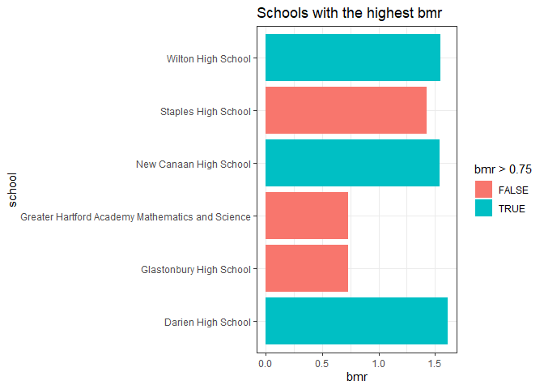

SAT Benchmark Performance in Connecticut in 2012-13
================

By Michael Chen , Mingyang Su and Alex P Zhang

## Introduction

Our goal is to practice and develop our Exploratory Data Analysis(EDA)
skills in R.

In this project we analyze the distributions of SAT Benchmark
Performance among high schools in the state of Connecticut from 2012 to
2013, then try to find the relationship between the number of senior
students and their SAT Benchmark Performance.

This project uses a primary dataset
which(SAT\_School\_Participation\_and\_Performance\_\_2012-2013.csv) has
been downloaded from the link:
<https://catalog.data.gov/dataset/sat-school-participation-and-performance-2012-2013>.

The SAT benchmarks are designed to measure the college readiness of high
school students, using the SAT, a college entrance examination taken by
nearly 1.45 million students in all 50 United States and the District of
Columbia. The SAT benchmark determined in this study was 1550 for the
composite. According to research conducted by the College Board, a score
of 1550 indicates that a student will have a 65 percent or greater
likelihood of achieving a B- average or higher during the first year of
college. (College Board. 250 Vesey Street, New York, NY 10281. Tel:
212-713-8000; e-mail: <research@collegeboard.org>; Web site:
<http://research.collegeboard.org>)

The primary dataset provided SAT Benchmark Meeting and participation
rate, but it did not exactly show how many senior students reach the
Benchmark, and the Percent among the total number of senior students in
the schools. Therefore, we created a new index called BMR(Benchmark
Meeting Rate),which comes through the number of Benchmark-Meeting
seniors divided by the number of total seniors in the same school. We
use BMR to evaluate SAT Benchmark Performance among high schools in
Connecticut in 2012 and 2013.

Also we use second dataset:The CORGIS dataset
(<https://corgis-edu.github.io/corgis/csv/school_scores/>).This dataset
includes SAT Scores across the country from 2005 to 2015. Certainly we
will focus on Connecticut’s data from 2012 to 2013 which is comparable
in this project. Not like the primary dataset showing each schools, this
one just presents the statistic data for each
states.

## Questions and Findings

### What is the relationship between a school’s senior population and the school’s benchmark-meeting rate?

``` r
data <- read_csv("C:/Users/alex/Documents/SAT-Benchmark-Group-Report/SAT_School_Participation_and_Performance__2012-2013.csv")
```

    ## Parsed with column specification:
    ## cols(
    ##   `District Number` = col_double(),
    ##   District = col_character(),
    ##   School = col_character(),
    ##   `Test-takers: 2012` = col_double(),
    ##   `Test-takers: 2013` = col_double(),
    ##   `Test-takers: Change%` = col_double(),
    ##   `Participation Rate (estimate): 2012` = col_double(),
    ##   `Participation Rate (estimate): 2013` = col_double(),
    ##   `Participation Rate (estimate): Change%` = col_double(),
    ##   `Percent Meeting Benchmark: 2012` = col_double(),
    ##   `Percent Meeting Benchmark: 2013` = col_double(),
    ##   `Percent Meeting Benchmark: Change%` = col_double()
    ## )

``` r
df <- data %>% 
  select(-1, -6, -9, -12) %>% 
  rename(district = "District", school = "School", t_takes2012 = "Test-takers: 2012", t_takes2013 = "Test-takers: 2013", part_rate2012 = "Participation Rate (estimate): 2012", part_rate2013 = "Participation Rate (estimate): 2013", perc_mb2012 = "Percent Meeting Benchmark: 2012", perc_mb2013 = "Percent Meeting Benchmark: 2013")
df <- df %>% 
  dplyr::filter(!(is.na(t_takes2012) | is.na(t_takes2013) | is.na(part_rate2012) | is.na(part_rate2013) | is.na(perc_mb2012) | is.na(perc_mb2013)))
```

``` r
#df1 is for testtakers for each school+year
df1 <- df %>% 
  select(1:4) %>% 
  rename(`2012` = t_takes2012, `2013` = t_takes2013) %>% 
  gather(3,4,key = "year", value = "t_takes") %>% 
  arrange(school)
#df2 is participation rate for each school+year
df2 <- df %>% select(1,2,5,6) %>% 
  rename(`2012` = part_rate2012, `2013` = part_rate2013) %>% 
  gather(3,4,key = "year", value = "part_rate")
#df3 is percentage meeting benchmark for each school+year
df3 <- df %>% 
  select(1,2,7,8) %>% 
  rename(`2012` = perc_mb2012, `2013` = perc_mb2013) %>% 
  gather(3,4,key = "year", value = "perc_mb")
#df4 combines them all
#BMR is calculated as such:
#bmr = number of meeting Benchmark / number of total seniors = (t_takes*perc_mb) / (t_takes/part_rate) = perc_mb*part_rate
df4 <- df1 %>% 
  full_join(df2,by = c("district","school","year")) %>% 
  full_join(df3,by = c("district","school","year"))
df4 <- df4 %>% 
  mutate(bmr = perc_mb*part_rate*1e-4)
```

First we’ll get the senior population for each school (denoted as pop)

``` r
data <- df4 %>% mutate(pop = floor(1e2*t_takes / part_rate))
data
```

    ## # A tibble: 374 x 8
    ##    district        school      year  t_takes part_rate perc_mb    bmr   pop
    ##    <chr>           <chr>       <chr>   <dbl>     <dbl>   <dbl>  <dbl> <dbl>
    ##  1 Stamford        Academy of~ 2012      133        82      47 0.385    162
    ##  2 Stamford        Academy of~ 2013      142        88      51 0.449    161
    ##  3 Connecticut Te~ Albert I P~ 2012       92        58       1 0.0058   158
    ##  4 Connecticut Te~ Albert I P~ 2013       88        55       0 0        160
    ##  5 Amistad Academ~ Amistad Ac~ 2012       34       100      32 0.32      34
    ##  6 Amistad Academ~ Amistad Ac~ 2013       31       100      39 0.39      31
    ##  7 Regional 05     Amity Regi~ 2012      381        87      61 0.531    437
    ##  8 Regional 05     Amity Regi~ 2013      348        80      63 0.504    435
    ##  9 Ansonia         Ansonia Hi~ 2012      118        67      18 0.121    176
    ## 10 Ansonia         Ansonia Hi~ 2013      104        61      18 0.110    170
    ## # ... with 364 more rows

Let’s see the trend of bmr vs year

``` r
data %>% 
  ggplot(aes(x = year, y = bmr, fill = year)) + 
  geom_boxplot() + labs(
    title = "2012-13 School Benchmark Performance in Connecticut",
    y = "Benchmark Meeting Rate", x = "Year"
  ) + theme_bw()
```

<!-- -->

From the graphic above, in 2012 the BMRs of Connecticut schools
distributed from 0 to 80 percent, but in 2013 the rate went up a little
bit, a couple of schools’ numbers almost over 80 percent. And average
BMRs for both years were around 30 percent with slight increasing trend.

We’ll plot the data to see if we can recognize any patterns.

``` r
ggplot(data) + 
  geom_point(aes(pop,bmr),alpha=4/9,size=3) + 
  facet_wrap(~year) + 
  theme_bw() + 
  labs(title="Senior Population vs Benchmark Meeting Rate",caption="This shows the population vs bmr for each year.")
```

<!-- -->

The data is relatively scattered, but we can see a weak positive linear
trend.

We can create a linear model using root mean squared residuals.

``` r
#root-mean-square residuals
measure_distance <- function(mod,data){
  diff <- data$bmr - (mod[1] + data$pop*mod[2])
  sqrt(mean(diff^2))
}
best <- optim(c(0, 0), measure_distance, data = data)
ggplot(data, aes(pop, bmr)) + 
  geom_point(size = 2, colour = "grey30") + 
  geom_abline(color="blue",intercept = best$par[1], slope = best$par[2]) + 
  theme_bw() + 
  labs(title="Fitting a linear model") + 
  facet_wrap(~year)
```

<!-- -->

However, there’s still many points in the data that are far from our
linear model. Let’s try out some nonlinear models to see if it can fit
the data any better.

``` r
mod1 <- lm(bmr ~ ns(pop, 1), data = data)
mod2 <- lm(bmr ~ ns(pop, 2), data = data)
mod3 <- lm(bmr ~ log(pop, base = exp(1)), data = data)
mod4 <- lm(bmr ~ I(pop^2), data = data)
data %>% 
  gather_predictions(mod1, mod2, mod3, mod4) %>%
  ggplot(aes(pop, bmr)) + 
  geom_point(alpha=2/5) +
  geom_line(aes(pop,pred), colour = "red") +
  facet_grid(year~ model) + 
  theme_bw() + 
  labs(title="Fitting non-linear models")
```

<!-- -->

None of these models appear very satisfactory since many data points are
still ommitted. But we can’t conclude that a model isn’t good just by
appearance, we also have to examine other factors of the models to check
how good it is. Let’s check the residuals for any patterns.

``` r
data %>%
  gather_residuals(mod1,mod2,mod3,mod4) %>%
  ggplot(aes(resid)) + 
  geom_freqpoly(binwidth = 0.05) + 
  geom_vline(xintercept = 0, colour = "Green", size=0.5) + 
  facet_grid(year ~ model) + 
  theme_bw() + 
  labs(title="Distribution of residuals")
```

<!-- -->

Except the first model, all the other residuals have an approximately
normal distribution around 0, which are good.

``` r
data %>%
  gather_residuals(mod1,mod2,mod3,mod4) %>%
  ggplot(aes(pop, resid)) + 
  geom_hline(yintercept = 0, colour = "green", size = 2) + 
  geom_point(alpha=2/5) + 
  facet_grid(year ~ model) + 
  theme_bw() + 
  labs()
```

<!-- -->

There appears to be no pattern in our residual plot for all of the
models, which is also a good thing. The last thing we need to check is
the coefficient of
determination.

``` r
print(str_c("r^2 of 1-degree of freedom cubic spline model: ", round(summary(mod1)$r.squared,3)  ))
```

    ## [1] "r^2 of 1-degree of freedom cubic spline model: 0.126"

``` r
print(str_c("r^2 of 2-degrees of freedom cubic spline model: ", round(summary(mod2)$r.squared,3)  ))
```

    ## [1] "r^2 of 2-degrees of freedom cubic spline model: 0.138"

``` r
print(str_c("r^2 of logarithmic model: ", round(summary(mod3)$r.squared,3)  ))
```

    ## [1] "r^2 of logarithmic model: 0.125"

``` r
print(str_c("r^2 of 2nd-degree polynomial model: ", round(summary(mod4)$r.squared,3)  ))
```

    ## [1] "r^2 of 2nd-degree polynomial model: 0.09"

These coefficients are pretty low overall, which are not good. The model
with highest coefficient of determination is mod2, the 2-degrees of
freedom cubic spline model, so this is the best model we have so far.
When predicting a school’s benchmark meeting rate based on its
population, we can use this model, and be correct about 13.8% of the
time.

### What’s significant about the schools with the highest bmr?

We find the schools with the highest bmr.

``` r
df4 %>% 
  arrange(desc(bmr)) %>%
  head(10) %>%
  ggplot() +
  geom_bar(aes(school,bmr,fill = bmr>0.75),stat="identity") +
  coord_flip() + 
  theme_bw() +
  labs(title="Schools with the highest bmr")
```

<!-- -->

We’ll focus on the top 3 schools: Darien High School, New Canaan High
School, and Wilton High
School.

``` r
Top3 <- data %>% dplyr::filter(school == "Darien High School" | school == "New Canaan High School" | school == "Wilton High School")
NotTop3 <- data %>% dplyr::filter(school != "Darien High School" & school != "New Canaan High School" & school != "Wilton High School")
ggplot() + 
  geom_point(data=Top3,aes(pop,bmr), color = "Red", size=3) +
  geom_point(data=NotTop3,aes(pop,bmr), color="Gray") +
  facet_wrap(~year) + 
  theme_bw() + 
  labs(title="Graph with highest bmr schools emphasized")
```

<!-- -->

If we were to zoom in those in those 3 schools,

``` r
ggplot() + 
  geom_point(data=Top3,aes(pop,bmr), color = "Red", size=3) +
  facet_wrap(~year) + 
  theme_bw() + 
  labs(title="Focusing on the senior populatin of the 3 highest-bmr schools")
```

<!-- -->

We can see that they fall around the 300-330 population
range.

### How does our BMR index of the entire Connecticut schools compare with the CORGIS Dataset?

The CORGIS dataset is from
<https://corgis-edu.github.io/corgis/csv/school_scores/>

``` r
corgis <- read_csv("C:/Users/alex/Documents/SAT-Benchmark-Group-Report/school_scores.csv")
```

    ## Parsed with column specification:
    ## cols(
    ##   .default = col_double(),
    ##   State.Code = col_character(),
    ##   State.Name = col_character()
    ## )

    ## See spec(...) for full column specifications.

``` r
colnames(corgis%>%select(1,4:6,66,69,72,75,78,81,84,87,90,93,96,99))
```

    ##  [1] "Year"                                        
    ##  [2] "Total.Math"                                  
    ##  [3] "Total.Test-takers"                           
    ##  [4] "Total.Verbal"                                
    ##  [5] "Score Ranges.Between 200 to 300.Math.Total"  
    ##  [6] "Score Ranges.Between 200 to 300.Verbal.Total"
    ##  [7] "Score Ranges.Between 300 to 400.Math.Total"  
    ##  [8] "Score Ranges.Between 300 to 400.Verbal.Total"
    ##  [9] "Score Ranges.Between 400 to 500.Math.Total"  
    ## [10] "Score Ranges.Between 400 to 500.Verbal.Total"
    ## [11] "Score Ranges.Between 500 to 600.Math.Total"  
    ## [12] "Score Ranges.Between 500 to 600.Verbal.Total"
    ## [13] "Score Ranges.Between 600 to 700.Math.Total"  
    ## [14] "Score Ranges.Between 600 to 700.Verbal.Total"
    ## [15] "Score Ranges.Between 700 to 800.Math.Total"  
    ## [16] "Score Ranges.Between 700 to 800.Verbal.Total"

``` r
data2 <- corgis %>%
  #First get Connecticut schools in the year 2012 and 2013
  dplyr::filter(Year == 2012 | Year == 2013) %>%
  dplyr::filter(State.Name == "Connecticut") %>%
  select(1,4:6,66,69,72,75,78,81,84,87,90,93,96,99) %>%
  #rename for simplicity
  rename( year=Year,
          total="Total.Test-takers",
          Math_mean = "Total.Math",
          Verbal_mean="Total.Verbal",
          "200-300 Math"="Score Ranges.Between 200 to 300.Math.Total",
          "200-300 Verbal"="Score Ranges.Between 200 to 300.Verbal.Total",
          "300-400 Math"="Score Ranges.Between 300 to 400.Math.Total",
          "300-400 Verbal"="Score Ranges.Between 300 to 400.Verbal.Total",
          "400-500 Math"="Score Ranges.Between 400 to 500.Math.Total",
          "400-500 Verbal"="Score Ranges.Between 400 to 500.Verbal.Total",
          "500-600 Math"="Score Ranges.Between 500 to 600.Math.Total",
          "500-600 Verbal"="Score Ranges.Between 500 to 600.Verbal.Total",
          "600-700 Math"="Score Ranges.Between 600 to 700.Math.Total",
          "600-700 Verbal"="Score Ranges.Between 600 to 700.Verbal.Total",
          "700-800 Math"="Score Ranges.Between 700 to 800.Math.Total",
          "700-800 Verbal"="Score Ranges.Between 700 to 800.Verbal.Total"
          ) %>%
  #Calculate the total number for each range of SAT scores
  transmute(
    year=year,
    SAT_mean = Math_mean + Verbal_mean,
    test_takers = total,
    "400-600" = `200-300 Math` + `200-300 Verbal`/2,
    "600-800" = `300-400 Math` + `300-400 Verbal`/2,
    "800-1000" = `400-500 Math` + `400-500 Verbal`/2,
    "1000-1200" = `500-600 Math` + `500-600 Verbal`/2,
    "1200-1400" = `600-700 Math` + `600-700 Verbal`/2,
    "1400-1600" = `700-800 Math` + `700-800 Verbal`/2,
    ) %>%
  gather(key = "SAT_Score_Range", value = "Count", 4:9) %>%
  #Add factors
  mutate(SAT_Score_Range = factor(SAT_Score_Range,levels=c("400-600","600-800","800-1000","1000-1200","1200-1400","1400-1600")))
data2
```

    ## # A tibble: 12 x 5
    ##     year SAT_mean test_takers SAT_Score_Range  Count
    ##    <dbl>    <dbl>       <dbl> <fct>            <dbl>
    ##  1  2012     1017       36469 400-600          1688 
    ##  2  2013     1019       36053 400-600          1915 
    ##  3  2012     1017       36469 600-800          7426.
    ##  4  2013     1019       36053 600-800          7094.
    ##  5  2012     1017       36469 800-1000        15780.
    ##  6  2013     1019       36053 800-1000        15662.
    ##  7  2012     1017       36469 1000-1200       16368 
    ##  8  2013     1019       36053 1000-1200       16119 
    ##  9  2012     1017       36469 1200-1400       10136.
    ## 10  2013     1019       36053 1200-1400        9746 
    ## 11  2012     1017       36469 1400-1600        3307 
    ## 12  2013     1019       36053 1400-1600        3544.

Gather them and plot them

``` r
data2 %>% 
  dplyr::filter(year==2012) %>%
  mutate(percentage = Count/sum(Count), Count = Count/2) %>%
  select(1,2,4,6)
```

    ## # A tibble: 6 x 4
    ##    year SAT_mean SAT_Score_Range percentage
    ##   <dbl>    <dbl> <fct>                <dbl>
    ## 1  2012     1017 400-600             0.0309
    ## 2  2012     1017 600-800             0.136 
    ## 3  2012     1017 800-1000            0.288 
    ## 4  2012     1017 1000-1200           0.299 
    ## 5  2012     1017 1200-1400           0.185 
    ## 6  2012     1017 1400-1600           0.0605

``` r
data2 %>% 
  dplyr::filter(year==2013) %>%
  mutate(percentage = Count/sum(Count), Count = Count/2) %>%
  select(1,2,4,6)
```

    ## # A tibble: 6 x 4
    ##    year SAT_mean SAT_Score_Range percentage
    ##   <dbl>    <dbl> <fct>                <dbl>
    ## 1  2013     1019 400-600             0.0354
    ## 2  2013     1019 600-800             0.131 
    ## 3  2013     1019 800-1000            0.290 
    ## 4  2013     1019 1000-1200           0.298 
    ## 5  2013     1019 1200-1400           0.180 
    ## 6  2013     1019 1400-1600           0.0655

``` r
data2 %>% 
  ggplot() + 
  geom_bar(aes(SAT_Score_Range,Count),stat="identity") + 
  facet_wrap(~year) +
  theme_bw() + 
  theme(axis.text.x = element_text(angle = 50, hjust = 1))
```

<!-- -->

We know the mean is at 1017 for 2012, and 1018 for 2013. Since both
numbers are close to 1000, we may put the peak in between 800-1000 and
1000-1200. In a normal curve, a standard deviation should be about 34%
of the data. Here, 1000-1200 is about 30% of the data, which has a width
of 200, so we can ballpark the standard deviation to be around 210 for
both years.

For year 2012: Mean = 1014, Standard Deviation = 210. We wish to find
the percentage of students that met the benchmark.

Before we calculate the benchmark, we must take note of one thing. Our
first dataset (from Data.gov) has a total score of 2400, and the
benchmark was placed at 1550. Our second dataset (from CORGIS) has a
total score of 1600, since the Writing section wasn’t included, so in
order to calculate a new fitting benchmark, we will take a ratio.

1550 / 2400 = x / 1600

Solving this, we get x = 1033, so our new benchmark is placed at 1033.

To find the percentage of students that met this benchmark, we’ll
calculate a z-score.

``` r
tibble(
  x = seq(400,1600),
  y = (1/(210*sqrt(2*pi))) * exp(1)^((-1*(x-1014)^2)/(2*(210)^2))
  ) %>%
  ggplot() +
  geom_point(aes(x,y)) + 
  geom_vline(xintercept = 1033, colour = "Red") + 
  scale_x_continuous(breaks = seq(400,1600,by=100)) +
  theme_bw() +
  labs(y="",x="SAT Score")
```

<!-- -->

The area under the curve to the right of the red line is the percentage
of students who’ve met the benchmark in this dataset. We can calculate
the numerical value of this by finding the z-score first.

z-score = (1033 - 1014) / 210 = 2.5524

P(SAT\_Score \> 1033) = 1 - P(SAT\_Score \< 1033) = 1 -
pnorm(1033,1014,210)

So Benchmark Meeting rate in 2012 is the number below:0.46

``` r
1 - pnorm(1033,1014,210)
```

    ## [1] 0.4639544

So Benchmark Meeting rate in 2013 is the number below:0.47

``` r
1 - pnorm(1033,1018,210)
```

    ## [1] 0.4715283

It is reasonable that they were higher than median BMRs by about 0.3,
because the base numbers were different.

## Conclusion

According to the analysis, there were around 170 schools from
Connecticut in 2012 and 2013 considered in the project . We find that
senior students numbers in most school were less than 300, and in
average almost 30% senior students have met SAT Benchmark. If only
considering SAT test-taking senior students, almost 50% of them have met
this Benchmark. SAT Benchmark Performance of 2013 increasd a little bit
than 2012, but it did not show big change overall. There were 3 schools
from three districts had the outstanding performance in both years,
which were “Darien High School”, “New canaan High School” and “Wilton
High School”. All three schools had senior student scale around 300. We
concluded that in the state of Connecticut in 2012 and 2013, senior
student scale around 300 can make best SAT Benchmark Performance.

## Contributions

Alex - Created the formula for BMR, came up with the ideas on what to
explain from our model, tidied the data frame, and proofread the project
for any errors.

Michael - Created the models, analyzed each model, and made the plots
looking pretty, had special contribution to analysis of the CORGIS
dataset.

Hongyang - Wrote the Introduction, the Conlcusion, and added the graphs
for the schools with the highest bmr.
